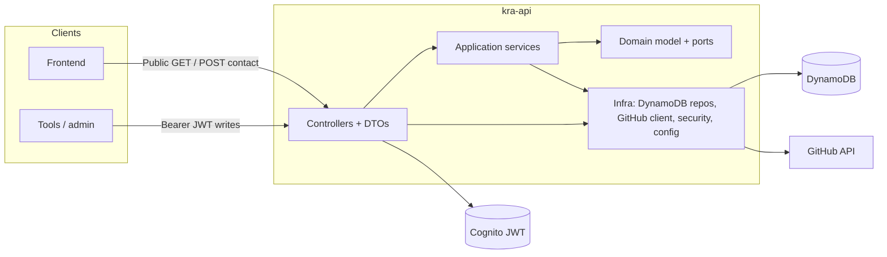

# kra-api

REST API for the **KRA** portfolio: projects and blog in **DynamoDB**, contact form (leads), public repo listing from **GitHub**, and repo detail. Project and blog **write** operations are protected with **JWT** (OAuth2 Resource Server, Cognito issuer); public reads and contact submission do not require a token.

Stack: **Spring Boot 3.5**, **Java 21**, **DDD** layering (domain free of Spring/AWS), persistence via **AWS SDK v2** (DynamoDB Enhanced Client), GitHub integration with **WebClient**, **Actuator** for health.

---

## Prerequisites

- Java 21+ and Maven
- AWS credentials when the API uses DynamoDB in AWS
- Environment variables — see [Configuration](#configuration); optional `.env` at the module root (loaded with lower precedence than system environment variables)

---

## Commands

| Action | Command |
|--------|---------|
| Compile | `mvn compile` |
| Run (default port 8080) | `mvn spring-boot:run` |
| Fast tests (domain / focused unit tests) | `mvn test -Dtest="ProjectTest,ProjectIdTest"` |
| Spring context test | `mvn test -Dtest="KraApiApplicationTests"` |
| Full test suite | `mvn test` |
| Runnable JAR | `mvn package -DskipTests` → `java -jar target/kra-api-0.0.1-SNAPSHOT.jar` |

---

## Endpoints

Base URL: `http://localhost:8080` (override with `SERVER_PORT`).

| Method | Path | Description | Auth |
|--------|------|-------------|------|
| `GET` | `/projects` | List projects (`limit` query, default 50, max 100) | Public |
| `GET` | `/projects/{id}` | Project detail | Public |
| `POST` | `/projects` | Create project | JWT |
| `PUT` | `/projects/{id}` | Update project | JWT |
| `DELETE` | `/projects/{id}` | Delete project | JWT |
| `GET` | `/posts` | List blog posts | Public |
| `GET` | `/posts/{slug}` | Post detail | Public |
| `POST` | `/posts` | Create post | JWT |
| `PUT` | `/posts/{slug}` | Update post | JWT |
| `DELETE` | `/posts/{slug}` | Delete post | JWT |
| `GET` | `/portfolio/repos` | List public repos for the portfolio GitHub user | Public |
| `GET` | `/portfolio/repos/{owner}/{repo}` | README, topics, languages, etc. | Public |
| `POST` | `/contact` | Submit lead (email + message) | Public |
| `GET` | `/actuator/health` | Health check | Public |

Other Actuator routes and any path not listed above require authentication per the security filter chain.

---

## Architecture



Packages: `domain` (models + repository interfaces), `application` (use cases), `infrastructure` (DynamoDB, web, GitHub, security, configuration). The domain layer does not depend on Spring or the AWS SDK.

### Project layout

```
kra-api/
├── .env.example
├── README.md
├── pom.xml
└── src/
    ├── main/
    │   ├── java/
    │   │   └── com/
    │   │       └── kra/
    │   │           └── api/
    │   │               ├── application/
    │   │               │   ├── BlogPostNotFoundException.java
    │   │               │   ├── BlogPostService.java
    │   │               │   ├── ContactService.java
    │   │               │   ├── ProjectNotFoundException.java
    │   │               │   └── ProjectService.java
    │   │               ├── domain/
    │   │               │   ├── model/
    │   │               │   │   ├── BlogPost.java
    │   │               │   │   ├── BlogSlug.java
    │   │               │   │   ├── Lead.java
    │   │               │   │   ├── Project.java
    │   │               │   │   └── ProjectId.java
    │   │               │   └── repository/
    │   │               │       ├── BlogPostRepository.java
    │   │               │       ├── LeadRepository.java
    │   │               │       └── ProjectRepository.java
    │   │               ├── infrastructure/
    │   │               │   ├── config/
    │   │               │   │   ├── DynamoDbConfig.java
    │   │               │   │   ├── GitHubProperties.java
    │   │               │   │   ├── GitHubWebClientConfiguration.java
    │   │               │   │   ├── SecurityConfig.java
    │   │               │   │   └── WebCorsConfiguration.java
    │   │               │   ├── github/
    │   │               │   │   ├── GitHubApiException.java
    │   │               │   │   └── GitHubPortfolioClient.java
    │   │               │   ├── repository/
    │   │               │   │   ├── DynamoDbBlogPostRepository.java
    │   │               │   │   ├── DynamoDbLeadRepository.java
    │   │               │   │   ├── DynamoDbProjectRepository.java
    │   │               │   │   ├── LeadDynamoDbItem.java
    │   │               │   │   ├── PostDynamoDbItem.java
    │   │               │   │   └── ProjectDynamoDbItem.java
    │   │               │   ├── security/
    │   │               │   │   ├── CustomAccessDeniedHandler.java
    │   │               │   │   └── CustomAuthenticationEntryPoint.java
    │   │               │   ├── web/
    │   │               │   │   ├── dto/
    │   │               │   │   │   ├── BlogPostResponse.java
    │   │               │   │   │   ├── ContactAcceptedResponse.java
    │   │               │   │   │   ├── CreateBlogPostRequest.java
    │   │               │   │   │   ├── CreateContactRequest.java
    │   │               │   │   │   ├── CreateProjectRequest.java
    │   │               │   │   │   ├── PortfolioRepoDetailResponse.java
    │   │               │   │   │   ├── PortfolioRepoResponse.java
    │   │               │   │   │   ├── ProjectResponse.java
    │   │               │   │   │   ├── UpdateBlogPostRequest.java
    │   │               │   │   │   └── UpdateProjectRequest.java
    │   │               │   │   ├── BlogPostController.java
    │   │               │   │   ├── ContactController.java
    │   │               │   │   ├── GlobalExceptionHandler.java
    │   │               │   │   ├── PortfolioController.java
    │   │               │   │   └── ProjectController.java
    │   │               │   └── .gitkeep
    │   │               └── KraApiApplication.java
    │   └── resources/
    │       ├── static/
    │       ├── templates/
    │       └── application.properties
    └── test/
        └── java/
            └── com/
                └── kra/
                    └── api/
                        ├── application/
                        │   └── ProjectServiceTest.java
                        ├── domain/
                        │   └── model/
                        │       ├── ProjectIdTest.java
                        │       └── ProjectTest.java
                        ├── infrastructure/
                        │   └── web/
                        │       ├── BlogPostControllerTest.java
                        │       ├── ContactControllerTest.java
                        │       ├── PortfolioControllerTest.java
                        │       └── ProjectControllerTest.java
                        └── KraApiApplicationTests.java
```

---

## Configuration

Main variables (also in `.env.example`):

| Variable | Purpose |
|----------|---------|
| `COGNITO_ISSUER_URI` | JWT issuer (resource server) |
| `AWS_REGION` | AWS region |
| `AWS_DYNAMODB_TABLE_NAME` | DynamoDB table (defaults to `kra-table` when unset in properties) |
| `AWS_DYNAMODB_ENDPOINT_OVERRIDE` | Optional custom DynamoDB endpoint URL; unset uses the default for the configured region |
| `GITHUB_TOKEN` | GitHub API token (portfolio) |
| `GITHUB_PORTFOLIO_USER` | User whose repos are listed |
| `GITHUB_API_BASE_URL` | GitHub API base URL (optional; default `https://api.github.com`) |
| `SERVER_PORT` | HTTP port (default `8080`) |

Equivalent keys in `application.properties` use dotted names (`aws.region`, `spring.security.oauth2.resourceserver.jwt.issuer-uri`, etc.).
