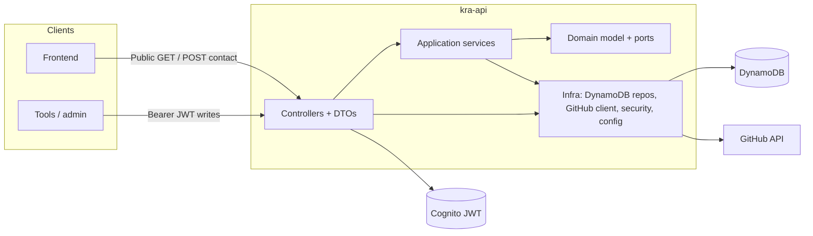

# kra-api

REST API for the **KRA** portfolio: projects and blog backed by **DynamoDB**, contact form (leads), public GitHub repo listing and repo detail. **Write** operations on projects and posts require a **JWT** (Spring OAuth2 resource server, Cognito issuer). Public reads and `POST /contact` do not require a token.

**Stack:** Spring Boot **3.5**, Java **21**, **DDD**-style layering (domain free of Spring/AWS), AWS SDK **v2** (DynamoDB Enhanced Client), GitHub via **WebClient**, **Actuator** for health.

[](https://sonarcloud.io/summary/new_code?id=krealalejo_kra-api)


---

## Prerequisites

- **Java 21** and **Maven**
- **AWS credentials** when talking to real DynamoDB (default credential chain)
- Environment variables — see [Configuration](#configuration). Optional **`.env`** at the module root: keys are applied as **system properties** only if they are **not** already set in the process environment (existing OS env wins).

---

## Quick start

1. Copy `.env.example` to `.env` and set at least `AWS_DYNAMODB_TABLE_NAME`, `GITHUB_TOKEN`, `GITHUB_PORTFOLIO_USER`, and `COGNITO_ISSUER_URI` when exercising secured routes locally.
2. Run: `mvn spring-boot:run`
3. Health: `http://localhost:8080/actuator/health` (port overridable with `SERVER_PORT`).

---

## Commands

| Action | Command |
|--------|---------|
| Compile | `mvn compile` |
| Run (default port **8080**) | `mvn spring-boot:run` |
| Unit / slice tests | `mvn test` |
| Tests + **JaCoCo** report (`target/site/jacoco/index.html`) + **branch coverage gate** (80% on the measured bundle) | `mvn verify` |
| Fast domain checks (example) | `mvn test -Dtest="ProjectTest,ProjectIdTest"` |
| Spring context smoke test | `mvn test -Dtest=KraApiApplicationTests` |
| Runnable JAR | `mvn package -DskipTests` → `java -jar target/kra-api-0.0.1-SNAPSHOT.jar` |

JaCoCo excludes (from coverage rules and Sonar alignment): `KraApiApplication`, `infrastructure.config`, `infrastructure.repository`, `infrastructure.github`.

---

## Endpoints

Base URL: `http://localhost:8080` (override with `SERVER_PORT`).

| Method | Path | Description | Auth |
|--------|------|-------------|------|
| `GET` | `/projects` | List projects (`limit` query, default **50**, max **100**) | Public |
| `GET` | `/projects/{id}` | Project detail | Public |
| `POST` | `/projects` | Create project | JWT |
| `PUT` | `/projects/{id}` | Update project | JWT |
| `DELETE` | `/projects/{id}` | Delete project | JWT |
| `GET` | `/posts` | List blog posts | Public |
| `GET` | `/posts/{slug}` | Post detail | Public |
| `POST` | `/posts` | Create post | JWT |
| `PUT` | `/posts/{slug}` | Update post | JWT |
| `DELETE` | `/posts/{slug}` | Delete post | JWT |
| `GET` | `/portfolio/repos` | List public repos for the configured GitHub user | Public |
| `GET` | `/portfolio/repos/{owner}/{repo}` | Repo detail (README, topics, languages, …) | Public |
| `POST` | `/contact` | Submit lead (email + message) | Public |
| `GET` | `/actuator/health` | Health check | Public |

Any other path (including other Actuator endpoints) requires authentication per `SecurityConfig`.

---

## Architecture



> Full system architecture (C4 Level 1, 2 & 3): [kra-docs-architecture](https://github.com/krealalejo/kra-docs-architecture)

**Packages:** `domain` (models + repository interfaces), `application` (use cases), `infrastructure` (DynamoDB, HTTP, GitHub, security, configuration). The domain layer does not depend on Spring or the AWS SDK.

### Source layout

```
kra-api/
├── .env.example
├── README.md
├── pom.xml
└── src/
    ├── main/
    │   ├── java/com/kra/api/
    │   │   ├── KraApiApplication.java
    │   │   ├── application/          # services, not-found exceptions
    │   │   ├── domain/
    │   │   │   ├── model/
    │   │   │   └── repository/       # ports
    │   │   └── infrastructure/
    │   │       ├── config/           # DynamoDB, GitHub, security, CORS
    │   │       ├── github/
    │   │       ├── repository/       # DynamoDB adapters + table items
    │   │       ├── security/
    │   │       └── web/              # controllers, DTOs, exception handler
    │   └── resources/
    │       └── application.properties
    └── test/java/com/kra/api/
        ├── application/              # e.g. BlogPostServiceTest, ContactServiceTest, ProjectServiceTest
        ├── domain/model/             # e.g. BlogPostTest, BlogSlugTest, LeadTest, ProjectTest, …
        ├── infrastructure/web/       # *ControllerTest
        └── KraApiApplicationTests.java
```

---

## Configuration

Variables used in deployment and local `.env` (see `.env.example`):

| Variable | Purpose |
|----------|---------|
| `COGNITO_ISSUER_URI` | JWT issuer URI for the OAuth2 resource server |
| `AWS_REGION` | AWS region (default **eu-west-1** in `application.properties`) |
| `AWS_DYNAMODB_TABLE_NAME` | DynamoDB table name (**required** with the current `application.properties`, which maps it to `aws.dynamodb.table-name`) |
| `GITHUB_TOKEN` | GitHub API token for portfolio calls |
| `GITHUB_PORTFOLIO_USER` | GitHub user whose repos are listed |
| `GITHUB_API_BASE_URL` | Optional; defaults to `https://api.github.com` if blank |
| `SERVER_PORT` | HTTP port (default **8080**) |

Spring binds the same settings as `aws.region`, `aws.dynamodb.table-name`, `spring.security.oauth2.resourceserver.jwt.issuer-uri`, `github.*`, etc.

> **Note:** `.env.example` includes `AWS_DYNAMODB_ENDPOINT_OVERRIDE`; the current `DynamoDbClient` builder does **not** read it. Use the regional endpoint unless you extend `DynamoDbConfig` for a custom endpoint (for example LocalStack).
